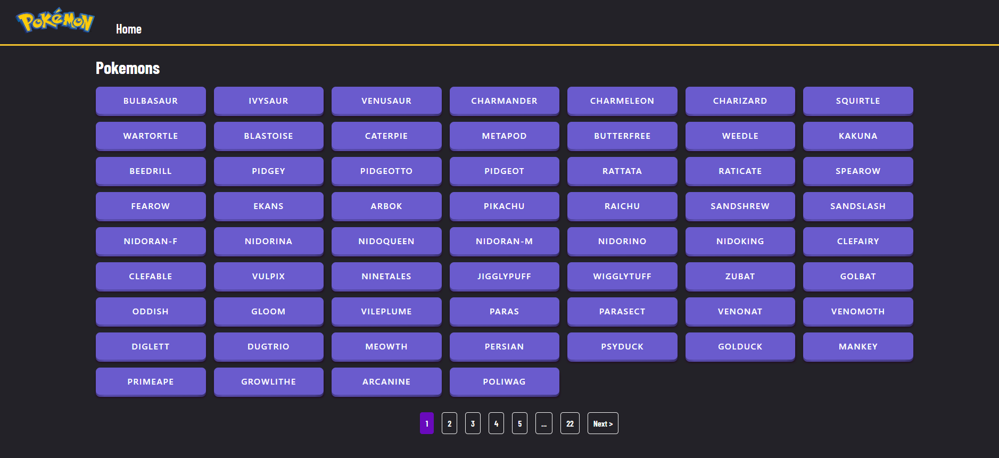
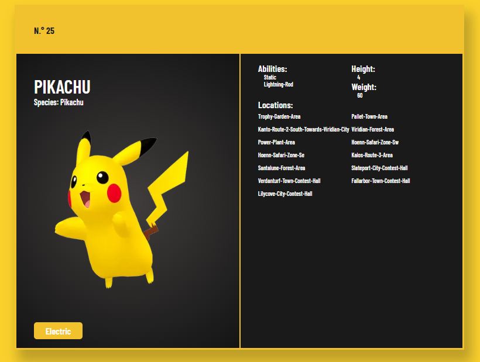

Projecto hecho con  [Next.js](https://nextjs.org/)

## Ejecutar el servidor de desarrollo:

```bash
npm run dev
# or
yarn dev
```

Abre [http://localhost:3000](http://localhost:3000) desde tu navegador y listo.
### Home view

Contiene un listado con paginación de los 1292 pokémon a través del consumo de la API [PokeApi](https://pokeapi.co/)


### Pokemon dinamic view
Información del Pokémon seleccionado.
<div style='display: block'>

</div>